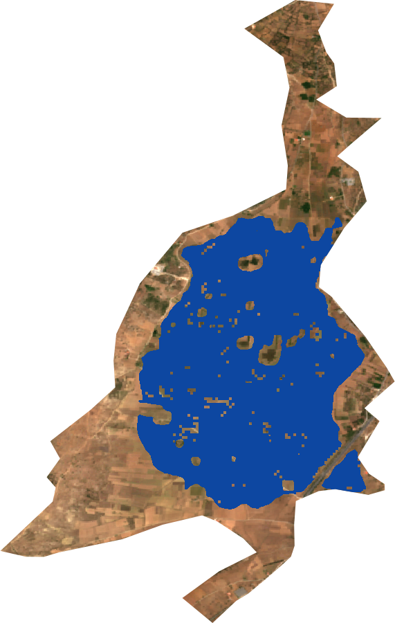
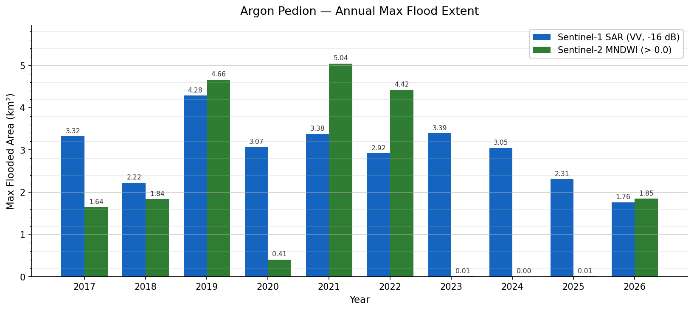
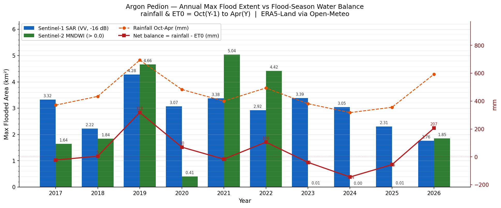

# Argon Pedion Flood Mapping

Seasonal flood extent mapping of the Argon Pedion karst plain (Arcadia, Greece) using Sentinel-1 SAR and Sentinel-2 optical imagery, processed via Google Earth Engine and validated against the JRC Global Surface Water dataset.

This is a learning project, built to practise multi-source remote sensing, radar image processing, and quantitative validation — and to document what works, what doesn't, and why.

---

## Study Area

**Argon Pedion** (Αργόν Πεδίον — Greek for "untilled plain") is a karst polje in the Arcadian highlands of the central Peloponnese, Greece (37°38′N, 22°27′E). It measures roughly 4 × 2 km and sits within the larger Tripoli Basin.

<table>
<tr>
<td width="50%">

<sub>Temporary lake during a flood event. The A7 motorway embankment is visible; tree tops in the foreground are submerged. The ditch leads to the ponor (sinkhole) below Nestani village. <i>Wikimedia Commons, CC BY-SA 3.0</i></sub>
</td>
<td width="50%">

<sub>Aerial view of the polje showing its enclosed basin geometry. Flood water has no surface outlet — drainage is entirely subsurface through the katavothra. <i>Wikimedia Commons, CC BY-SA 3.0</i></sub>
</td>
</tr>
</table>

The basin is geologically enclosed: the only drainage is a single **katavothra** (karst sinkhole) in the limestone wall below Nestani village. When winter rainfall exceeds the sinkhole's capacity, the plain floods and temporarily becomes a lake. Tracer studies have shown that water entering the katavothra re-emerges at the **Kiveri submarine spring** in the Argolic Gulf — approximately 30 km away and 190 hours later.


<sub>Kiveri submarine karst spring, Argolic Gulf — the surface re-emergence point of water that drains through the Argon Pedion katavothra. <i>Wikimedia Commons, CC BY-SA 3.0</i></sub>

The temporary lake has been documented in 2003, 2014, and most extensively in **March 2019**. The ancient geographer Pausanias described the plain in the 2nd century AD: *"a plain called the Untilled Plain, where rainwater disappears into a chasm in the earth."*

*Wikipedia source: [Argon Pedion](https://en.wikipedia.org/wiki/Argon_Pedion), text under CC BY-SA 4.0; images via Wikimedia Commons, CC BY-SA 3.0.*

---

## Remote Sensing Concepts

### What is Synthetic Aperture Radar (SAR)?

Most Earth observation satellites are passive — they record reflected sunlight, so they cannot operate at night or through clouds. **SAR (Synthetic Aperture Radar)** satellites are active sensors: they transmit their own microwave pulses and record the energy scattered back from the surface. Because microwaves pass through cloud cover and do not rely on sunlight, SAR works day and night in any weather.

This matters enormously for flood mapping. Floods occur during exactly the conditions that blind optical satellites — heavy overcast winter rainstorms. SAR sees through the clouds.

### How SAR Detects Open Water

Open water acts as a near-perfect mirror for radar: almost all energy reflects *away* from the satellite, producing a very low (dark) return signal. Rough surfaces — vegetation, soil, buildings — scatter energy back strongly, producing bright returns. This contrast is measured in **decibels (dB)**:

- Open water typically: **–20 to –16 dB** (very dark, most energy reflected away)
- Vegetated land typically: **–10 to –5 dB** (bright, rough scattering)

A threshold is applied: pixels below a chosen dB value are classified as water.

### Sentinel-1 (S1)

[Sentinel-1](https://www.esa.int/Applications/Observing_the_Earth/Copernicus/Sentinel-1) is the European Space Agency's C-band SAR constellation (5.4 GHz). It operates in **VV polarisation** (vertically transmitted, vertically received) over land, which is the most sensitive channel for detecting open water surfaces. Spatial resolution: ~10 m. Revisit time over Greece: ~6 days.

### Sentinel-2 (S2)

[Sentinel-2](https://www.esa.int/Applications/Observing_the_Earth/Copernicus/Sentinel-2) is an optical multispectral satellite constellation. It records reflected sunlight in 13 spectral bands from visible to shortwave infrared (SWIR). Unlike SAR, it cannot see through clouds. Water is detected via the **Modified Normalised Difference Water Index (MNDWI)**:

```
MNDWI = (Green − SWIR) / (Green + SWIR)
```

Water has high green reflectance and near-zero SWIR reflectance → high positive MNDWI. Land has the opposite relationship. An **Otsu threshold** (automatic histogram-based separation) is applied per month to find the optimal water/land boundary.

### JRC Global Surface Water

The [JRC Global Surface Water](https://global-surface-water.appspot.com/) dataset (Pekel et al., 2016) maps water extent globally from 1984 to 2021 using Landsat imagery at 30 m resolution. It provides:

- **Max extent**: the largest water body ever detected in any year — a physical ceiling for plausible flood area
- **Occurrence**: the fraction of years a pixel was observed as water — distinguishing permanent lakes from episodic floods
- **Yearly history**: annual water maps, used here for direct year-by-year validation

Because Landsat is optical, JRC also suffers from cloud masking. However, it provides the best available multi-decadal baseline for this site.

---

## Methodology

### 1. Area of Interest

The study area polygon was manually traced around the visible floodplain in the GEE Code Editor. It covers the flat valley floor (slope < 5°) of the Argon Pedion, approximately 9.4 km².

### 2. Sentinel-1 Processing

For each flood season (October–April, 2017–2026):

1. **Filter** the S1 GRD archive to IW mode, VV polarisation, flood-season months
2. **Speckle filter**: apply a 7×7 focal mean in linear power space (not dB) to reduce salt-and-pepper noise inherent in radar imagery
3. **Classify water**: apply the site-calibrated threshold of **–16 dB** (see Threshold Calibration below)
4. **Topographic mask**: exclude pixels on slopes > 5° to remove radar shadow and layover artefacts from surrounding limestone hills
5. **Find annual peak**: select the scene with the largest flooded area per year

### 3. Threshold Calibration

The standard literature threshold of **–15 dB** was tested against a dry-season (June–August) S1 median composite. Even in summer, 17.9% of the AOI fell below –15 dB — a clear sign the threshold was too lenient for this flat agricultural plain. Systematic testing across multiple thresholds yielded:

| Threshold | Dry-season false positives | 2019 flood detection | vs JRC max (4.51 km²) |
|-----------|---------------------------|---------------------|----------------------|
| –15 dB | 0.35 km² (3.7%) | 4.35 km² | –0.16 km² |
| **–16 dB** | **0.006 km² (0.06%)** | **4.28 km²** | **–0.23 km²** |
| –17 dB | 0.000 km² | 3.94 km² | –0.57 km² |
| –18 dB | 0.000 km² | 3.62 km² | –0.89 km² |

**–16 dB** was selected: it eliminates virtually all dry-season false positives while preserving 95% of the JRC maximum extent in the 2019 peak flood year.

### 4. Sentinel-2 Processing

For each flood-season month:

1. Load S2 Surface Reflectance imagery and join with **Cloud Score Plus** (GOOGLE/CLOUD_SCORE_PLUS) to mask cloud shadows — shadows have low reflectance that mimics water in MNDWI
2. Compute MNDWI (B3 Green / B11 SWIR) per scene
3. Build a monthly maximum MNDWI composite
4. Apply **Otsu thresholding** on the MNDWI histogram to find the optimal water/land boundary automatically
5. Apply topographic mask; compute flooded area
6. Select the month with the largest extent as the annual S2 peak

### 5. Climate Context

Flood-season (October–April) precipitation and reference evapotranspiration (ET₀) are retrieved from the **Open-Meteo archive API** (ERA5-Land reanalysis) at the AOI centroid. Net water balance (rainfall − ET₀) is computed as a first-order proxy for water availability at the plain.

---

## Outputs

### 2019 Peak Flood — Sentinel-1 SAR Detection

The February 2019 event was the largest flood in the satellite record. The blue overlay shows SAR-detected open water on a Sentinel-2 dry-season basemap. This is the year where S1 (4.28 km²) and JRC Landsat (4.46 km²) agree most closely, confirming the detection is genuine.



### Annual Maximum Flood Extent — S1 vs S2



### Flood Extent vs Flood-Season Water Balance



---

## Validation Against JRC Global Surface Water

The calibrated S1 results were validated against JRC yearly water history (Landsat-derived, 30 m):

| Year | S1 –16 dB (km²) | JRC Landsat (km²) | Difference |
|------|-----------------|-------------------|------------|
| 2017 | 3.32 | 0.29 | +3.03 |
| 2018 | 2.22 | 1.12 | +1.10 |
| **2019** | **4.28** | **4.46** | **–0.18** ✓ |
| 2020 | 3.07 | 0.01 | +3.06 |
| 2021 | 3.38 | 0.38 | +3.00 |

**2019 is the only year where S1 and JRC agree closely** — the one year in the record where flooding was severe enough that open standing water was unambiguous to both sensors. In all other years, S1 detects 2.2–4.1 km² that Landsat does not classify as water.

The JRC occurrence statistics reinforce the episodic nature of this plain: **no pixel appears as water in even 10% of years** over the 1984–2021 Landsat record, despite the JRC maximum extent reaching 4.51 km². This confirms that large-scale inundation is rare and brief — the 2019 event was exceptional.

---

## Limitations and Caveats

### 1. Wet Soil Confusion (Principal Limitation)

The most significant problem with simple SAR thresholding on flat agricultural land is that **saturated or waterlogged soil can produce backscatter values indistinguishable from open water**. After heavy rainfall, fields absorb water and their surface roughness decreases, pushing VV backscatter down toward –16 dB or below — the same range as a water surface.

The JRC comparison makes this concrete: in 2020, S1 detects 3.07 km² while Landsat sees 0.009 km². The fields were likely wet and compacted, not flooded. S1 cannot tell them apart with a simple threshold.

This explains the persistent "floor" of ~2–3 km² in S1 detections across all years, including dry ones.

### 2. Year Boundary Split

The flood season straddles the calendar year (October–April). This analysis assigns scenes to their calendar year — October 2025 scenes belong to year 2025, January 2026 scenes to 2026. A genuinely wet winter (e.g., Oct 2025–Apr 2026) can therefore appear split between two consecutive years, underestimating either. A hydrological-year approach (Oct–Sep) would be more correct.

### 3. S2 Cloud Masking

Cloud Score Plus removes cloudy pixels aggressively. In years with persistent winter cloud cover (2023–2025), so few clear scenes remain that the Otsu algorithm has almost no signal to work with, returning near-zero detections. S2 values for those years should be treated as data-quality failures, not evidence of no flooding.

### 4. S1 vs S2 Comparison Asymmetry

The two sensors are not measuring the same thing in the same way:
- **S1** selects the single scene with the largest flood extent (a snapshot)
- **S2** selects the month with the largest MNDWI composite maximum (averaged over cloud-free scenes)

A flood that peaks briefly and then recedes will be well-captured by S1 but may be diluted in S2's monthly composite.

### 5. No Ground Truth

There are no in-situ flood records, gauging station data, or eyewitness accounts to validate any individual detection. All results should be treated as remotely sensed estimates subject to the limitations above.

---

## How to Make This More Robust

### Change Detection Instead of Absolute Thresholding

Rather than applying a fixed dB cutoff, compare each flood-season scene to a **site-specific dry baseline** (a summer median composite). A pixel is classified as flooded only if its backscatter drops by more than a threshold delta (e.g., –3 dB) relative to its own dry-season reference. This approach:
- Inherently compensates for spatially variable backscatter (different land covers, soil types)
- Eliminates wet-soil confusion that affects absolute thresholds
- Is more robust across years and sites

### VH Polarisation and Dual-Pol Ratio

Sentinel-1 also records **VH polarisation** (vertically transmitted, horizontally received). The **VH/VV ratio** is sensitive to volume scattering from vegetation, which helps distinguish open water (low ratio) from flooded vegetation (higher ratio). Using both bands together improves classification accuracy on vegetated floodplains.

### Machine Learning Classification

Training a random forest or support vector machine classifier on labelled examples (confirmed flood / confirmed dry) from multiple dates could learn the local backscatter signature more accurately than a single threshold. The 2019 event provides a strong positive training sample; dry summer dates provide negatives.

### Integration with Hydrological Data

Correlating flood extent with rainfall totals, antecedent soil moisture (from Copernicus Global Land Service or Sentinel-1 soil moisture products), and katavothra outflow estimates would enable a more physically meaningful model of when and how much the plain floods.

### Higher-Resolution Validation

Cross-referencing S1 detections with drone surveys or very-high-resolution (VHR) optical imagery (e.g., Planet, Pleiades) during a flood event would provide ground truth to quantify the wet-soil confusion error directly.

---

## Repository Structure

```
├── Data/
│   ├── floodplain.gpkg          # AOI polygon (GGRS87 / EPSG:2100)
│   └── floodplain.qgz           # QGIS project for AOI visualisation
├── GEE/
│   └── LEVEL 1/
│       ├── gee_s1_argon_pedion.js          # Sentinel-1 flood mapping script
│       ├── gee_s2_argon_pedion.js          # Sentinel-2 MNDWI flood mapping script
│       ├── gee_comparison_argon_pedion.js  # S1 vs S2 comparison and export
│       ├── LEVEL1_WALKTHROUGH.md           # Step-by-step GEE scripting guide
│       └── OPENMETEO_WALKTHROUGH.md        # ERA5-Land rainfall data guide
├── Python/
│   ├── run_gee_analysis.py         # Runs S1+S2 comparison via Python EE API
│   ├── recalc_s1.py                # Recalculates S1 with calibrated threshold
│   ├── calibrate_threshold.py      # Tests thresholds against dry-season FP
│   ├── validate_jrc.py             # Validates S1 against JRC yearly water
│   ├── fetch_rainfall.py           # ERA5-Land precipitation and ET₀ via Open-Meteo
│   ├── plot_comparison.py          # S1 vs S2 bar chart
│   └── plot_comparison_rainfall.py # Flood extent vs water balance chart
├── Outputs/
│   ├── CSV/
│   │   ├── argon_pedion_s1_vs_s2.csv   # Annual flood extent (S1 and S2)
│   │   └── argon_pedion_rainfall.csv   # Flood-season rainfall and ET₀
│   └── PNG/
│       ├── argon_pedion_s1_vs_s2.png
│       └── argon_pedion_s1_vs_s2_rainfall.png
└── README.md
```

---

## Tools and Data Sources

| Tool / Dataset | Purpose |
|---|---|
| Google Earth Engine (Python API) | Cloud-based satellite data processing |
| Sentinel-1 GRD (`COPERNICUS/S1_GRD`) | SAR flood detection |
| Sentinel-2 SR Harmonised (`COPERNICUS/S2_SR_HARMONIZED`) | Optical MNDWI flood detection |
| Cloud Score Plus (`GOOGLE/CLOUD_SCORE_PLUS/V1/S2_HARMONIZED`) | S2 cloud/shadow masking |
| JRC Global Surface Water (`JRC/GSW1_4/GlobalSurfaceWater`) | Validation baseline |
| SRTM DEM (`USGS/SRTMGL1_003`) | Topographic slope mask |
| Open-Meteo Archive API | ERA5-Land precipitation and ET₀ |
| Python — pandas, matplotlib | Data wrangling and charting |
| QGIS | AOI polygon digitisation |

---

## References

- Pekel, J.-F., Cottam, A., Gorelick, N., & Belward, A. S. (2016). High-resolution mapping of global surface water and its long-term changes. *Nature*, 540, 418–422.
- Filipponi, F. (2019). Sentinel-1 GRD Preprocessing Workflow. *Multidisciplinary Digital Publishing Institute Proceedings*, 18(1), 11.
- Wikipedia contributors. (2024). *Argon Pedion*. Wikipedia. https://en.wikipedia.org/wiki/Argon_Pedion (text CC BY-SA 4.0; images via Wikimedia Commons CC BY-SA 3.0)
